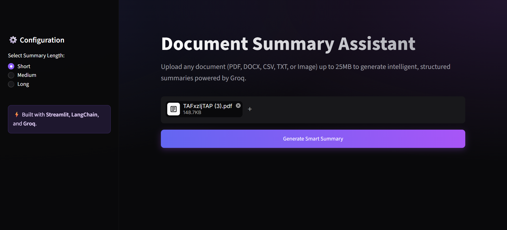
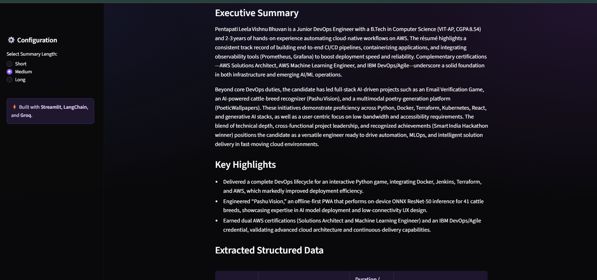
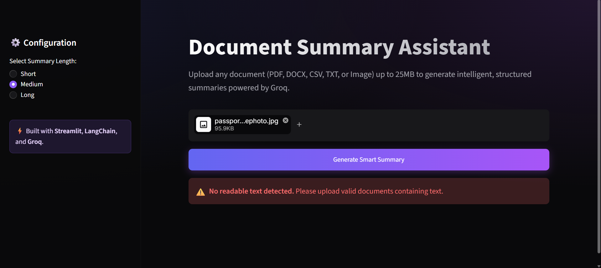

<div align="center">

# 📄 Document Summary Assistant

### Turn any document into a clear, structured summary in seconds — powered by Groq's blazing-fast LLM inference and LangChain.


[**🔗 Live Demo**](https://6058ea994cc3b8.lhr.life) · [**✨ Features**](#-features) · [**🚀 Getting Started**](#-getting-started) · [**💬 Interactive Chat**](#-interactive-document-qa)

</div>

> ⚠️ **Note on the live demo:** The link above is a temporary `localhost.run` tunnel to a local dev session, not a permanent deployment. It will stop working once that session ends. Be sure to swap it for a Streamlit Community Cloud or Render URL once deployed permanently.

---

## 📚 Table of Contents

1. [Overview](#-overview)
2. [Visual Tour & Screenshots](#️-visual-tour--screenshots)
3. [Key Features](#-features)
4. [Supported File Types](#-supported-file-types)
5. [Architecture & Tech Stack](#️-architecture--tech-stack)
6. [Getting Started (Local Installation)](#-getting-started)
7. [Usage Guide](#-usage-guide)
8. [Configuration & Environment Variables](#️-configuration)
9. [Project Structure](#-project-structure)
10. [Interactive Document Q&A](#-interactive-document-qa)
11. [Troubleshooting & FAQ](#-troubleshooting--faq)
12. [Future Roadmap](#️-roadmap)
13. [Contributing](#-contributing)
14. [License & Author](#-license--author)

---

## 🔍 Overview

Information overload is a real problem. Reading through massive PDFs, complex Word documents, or lengthy text files to extract actionable insights is incredibly time-consuming. 

**Document Summary Assistant** is an AI-powered tool designed to fix that. By leveraging the **Groq API** (which utilizes purpose-built LPU hardware for near-instantaneous LLM inference) and **LangChain** for robust document processing, this application allows users to upload a document, select their desired summary depth, and instantly receive a highly structured breakdown. 

Not only does it generate summaries, but it also features a built-in **Interactive Chat**, allowing users to ask follow-up questions and "talk" directly to their uploaded documents.

---

## 🖼️ Visual Tour & Screenshots

Here is a look at the Document Summary Assistant in action.

### 1. Upload & Configure
The sleek, dark-themed UI allows you to quickly upload a file and select how much detail you want back (Short, Medium, or Long).
<div align="center">

</div>

### 2. Structured Summary Output
Get your results neatly organized into an **Executive Summary**, **Key Highlights**, and **Extracted Structured Data**.
<div align="center">

</div>

### 3. Intelligent Error Handling & Validation
If you upload an unreadable file or an image without parseable text, the app catches it instantly and guides you to upload a valid file.
<div align="center">

</div>

---

## ✨ Features

*   ⚡ **Blazing Fast Inference:** Powered by Groq's Language Processing Units (LPUs), generating complex summaries in fractions of a second.
*   🎛️ **Customizable Detail Levels:** Choose between `Short`, `Medium`, and `Long` summary lengths based on your current reading needs.
*   🗂️ **Structured Data Extraction:** Doesn't just give you a wall of text. Returns Executive Summaries, Bulleted Highlights, and Data Tables.
*   💬 **Interactive Chat:** After generating a summary, enter the chat interface to ask specific questions about the document context.
*   🛡️ **Robust Validation:** Prevents API waste by pre-validating documents for readability before sending payloads to the LLM.
*   🌓 **Sleek UI/UX:** Built with Streamlit, providing a responsive, accessible, and highly polished dark-mode interface.
*   🧠 **Smart Chunking:** Utilizes LangChain's `RecursiveCharacterTextSplitter` to handle documents that exceed standard token windows without losing context.

---

## 📄 Supported File Types

The application currently supports the parsing and extraction of the following formats (Up to 25MB per file):

| File Extension | Content Type | Parsing Library Used |
| :--- | :--- | :--- |
| `.pdf` | Portable Document Format | `PyPDF2` / `pdfplumber` |
| `.docx` | Microsoft Word Document | `python-docx` |
| `.txt` | Plain Text | Native Python `open()` |
| `.csv` | Comma Separated Values | `pandas` |
| `.md` | Markdown | Native Python / LangChain |

*(Note: Image-based PDFs or raw image files currently trigger a validation warning unless OCR integration is explicitly enabled).*

---

## 🏗️ Architecture & Tech Stack

### Tech Stack
*   **Frontend/UI:** [Streamlit](https://streamlit.io/)
*   **LLM Orchestration:** [LangChain](https://www.langchain.com/)
*   **AI/Inference:** [Groq API](https://groq.com/) (Using `llama3-70b-8192` or `mixtral-8x7b-32768`)
*   **Data Processing:** Pandas, PyPDF2, python-docx
*   **Language:** Python 3.9+

### Application Flow
1.  **User Input:** User uploads a document and selects a configuration (Summary Length).
2.  **Text Extraction:** App identifies the file MIME type and routes it to the appropriate parser.
3.  **Validation:** Checks if the extracted text length is greater than 0. If not, throws a validation error.
4.  **Chunking (LangChain):** If the text is massive, it splits the text into manageable semantic chunks with overlap.
5.  **Prompt Injection:** Wraps the text in a highly engineered prompt dictating the structure (Executive, Highlights, Data).
6.  **Groq Inference:** Sends the payload to Groq's API.
7.  **Rendering:** Streamlit dynamically renders the Markdown output.
8.  **Chat Instantiation:** The document context is loaded into a conversational memory buffer, enabling the follow-up Q&A chat.

---

## 🚀 Getting Started

Follow these instructions to set up the project on your local machine for development and testing.

### Prerequisites
*   Python 3.9 or higher installed on your machine.
*   Git installed.
*   A free [Groq API Key](https://console.groq.com/keys).

### Installation Steps

**1. Clone the repository**
```bash
git clone [https://github.com/yourusername/document-summary-assistant.git](https://github.com/yourusername/document-summary-assistant.git)
cd document-summary-assistant