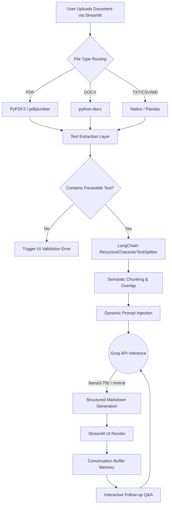

<div align="center">

# 📄 Document Summary Assistant

### Turn any document into a clear, structured summary in seconds — powered by Groq's blazing-fast LLM inference and LangChain.


[**🔗 Live Demo**](https://6058ea994cc3b8.lhr.life) · [**✨ Features**](#-key-features) · [**🚀 Getting Started**](#-getting-started-local-installation) · [**💬 Interactive Chat**](#-interactive-document-qa)

</div>

> ⚠️ **Note on the live demo:** The link above is a temporary tunnel to a local dev session. Be sure to swap it for a Streamlit Community Cloud or Render URL once deployed permanently.

---

## 📚 Table of Contents

1. [Overview](#-overview)
2. [Visual Tour & Screenshots](#️-visual-tour--screenshots)
3. [Architecture & Data Flow](#-architecture--data-flow)
4. [Key Features](#-key-features)
5. [Supported File Types](#-supported-file-types)
6. [Comprehensive Project Structure](#-comprehensive-project-structure)
7. [Challenges & Solutions Encountered](#-challenges--solutions-encountered)
8. [Getting Started (Local Installation)](#-getting-started-local-installation)
9. [Usage Guide](#-usage-guide)
10. [Configuration & Environment Variables](#️-configuration--environment-variables)
11. [Interactive Document Q&A](#-interactive-document-qa)
12. [Troubleshooting & FAQ](#-troubleshooting--faq)
13. [Future Roadmap](#️-future-roadmap)
14. [Contributing](#-contributing)
15. [License & Author](#-license--author)

---

## 🔍 Overview

Information overload is a critical bottleneck in modern workflows. Reading through massive PDFs, complex Word documents, or lengthy text files to extract actionable insights is incredibly time-consuming and prone to human error.

**Document Summary Assistant** is an AI-powered tool designed to solve this problem. By leveraging the **Groq API** (which utilizes purpose-built LPU hardware for near-instantaneous LLM inference) alongside **LangChain** for robust document processing, this application allows users to upload a document, select their desired summary depth, and instantly receive a highly structured breakdown.

Beyond static summarization, it features a built-in **Interactive Chat**, allowing users to query their uploaded documents in real-time, effectively turning static text into an interactive knowledge base.

---

## 🖼️ Visual Tour & Screenshots

Here is a look at the Document Summary Assistant in action.

### 1. Upload & Configure
The sleek, dark-themed UI allows you to quickly upload a file and select how much detail you want back (Short, Medium, or Long).

<div align="center">

</div>

### 2. Structured Summary Output
Results are not just a wall of text. They are neatly organized into an **Executive Summary**, **Key Highlights**, and **Extracted Structured Data**.

<div align="center">

</div>

### 3. Intelligent Error Handling & Validation
If an unreadable file or an image without parseable text is uploaded, the application catches it instantly and guides the user toward a valid upload.

<div align="center">

</div>

---

## 🧠 Architecture & Data Flow

The application is built on a streamlined, pipeline-driven architecture designed for speed and reliability. Below is the visualization of how user documents are processed from upload to conversational retrieval.



### Core Components

| Component | Responsibility |
|---|---|
| **Routing Engine** | Detects file MIME types and automatically assigns the optimal parsing library to ensure accurate text extraction. |
| **Validation Layer** | A lightweight pre-check that prevents malformed or empty payloads from reaching the expensive LLM processes. |
| **Chunking Module** | Employs LangChain's semantic splitting logic to divide massive documents into digestible tokens without losing context across boundaries. |
| **Memory Buffer** | Retains the conversation history and document context in the session state, enabling multi-turn conversational AI. |

---

## ✨ Key Features

- ⚡ **Blazing Fast Inference** — Powered by Groq's Language Processing Units (LPUs), generating complex summaries in fractions of a second.
- 🎛️ **Customizable Detail Levels** — Choose between Short, Medium, and Long summary lengths based on your current reading needs.
- 🗂️ **Structured Data Extraction** — Doesn't just give you a wall of text. Returns Executive Summaries, Bulleted Highlights, and Data Tables.
- 💬 **Interactive Chat** — After generating a summary, enter the chat interface to ask specific questions about the document context.
- 🛡️ **Robust Validation** — Prevents API waste by pre-validating documents for readability before sending payloads to the LLM.
- 🌓 **Sleek UI/UX** — Built with Streamlit, providing a responsive, accessible, and highly polished dark-mode interface.

---

## 📄 Supported File Types

The application currently supports the parsing and extraction of the following formats (up to 25MB per file):

| File Extension | Content Type | Parsing Library Used |
|---|---|---|
| `.pdf` | Portable Document Format | PyPDF2 / pdfplumber |
| `.docx` | Microsoft Word Document | python-docx |
| `.txt` | Plain Text | Native Python `open()` |
| `.csv` | Comma Separated Values | pandas |
| `.md` | Markdown | Native Python / LangChain |

---

## 🗂️ Comprehensive Project Structure

A clean, modular architecture makes maintaining and scaling the application simple.

```text
document-summary-assistant/
│
├── assets/                          # Static assets for documentation
│   ├── 01-homepage.png              # Standard relative path image
│   ├── 02-summary-output.png        # Standard relative path image
│   └── 03-validation-error.png      # Standard relative path image
│
├── utils/                           # Core logic & helper modules
│   ├── __init__.py
│   ├── document_parser.py           # Handles routing for PDF, DOCX, CSV parsing
│   ├── prompt_templates.py          # Contains engineered LangChain prompts
│   └── text_chunker.py              # Logic for recursive text splitting
│
├── app.py                           # Main Streamlit application entry point
├── config.py                        # Centralized configuration (Models, parameters)
├── requirements.txt                 # Python dependencies
├── .env.example                     # Boilerplate environment variables file
├── .gitignore                       # Git ignore rules for Python & environment
└── README.md                        # Project documentation
```

---

## 🧗 Challenges & Solutions Encountered

Building an AI-driven document parser comes with unique development hurdles. Here are the core engineering problems encountered during the build and how they were solved:

### 1. GitHub Markdown vs. Base64 Image Rendering
**The Problem:** Initially, UI screenshots were embedded directly into the `README.md` using Base64 data URIs. While this worked locally, GitHub's Markdown renderer actively strips Base64 image data for security and page-load optimization, leaving broken image placeholders in the repository.

**The Solution:** Refactored the repository structure to include a dedicated `/assets` folder. By saving all screenshots as static `.png` files and updating the Markdown to use standard relative file paths (``), the images now render flawlessly and securely on the GitHub repo page.

### 2. Groq API Rate Limits and Strict Context Windows
**The Problem:** Groq offers incredible speed, but pushing a 50-page PDF directly into the prompt exceeds both the strict token-per-minute (TPM) limits and the maximum context window of models like `llama3-70b-8192`.

**The Solution:** Implemented LangChain's `RecursiveCharacterTextSplitter`. This breaks the document down into manageable chunks (e.g., 2000 characters) with a strategic overlap (e.g., 200 characters). This allows the system to process large documents sequentially without dropping critical context that spans across chunk boundaries.

### 3. Handling Unreadable "Image-Only" Documents
**The Problem:** Users frequently upload PDFs that are actually just scanned images (like passports, receipts, or flattened e-photos). Standard text parsers like PyPDF2 read these as empty strings, which previously caused the API to throw parsing errors or hallucinate wildly inaccurate responses.

**The Solution:** Built a robust pre-validation layer. Before any API call is made, the app checks the length of the extracted text payload. If no text is found, it safely halts execution and throws a custom Streamlit UI error (`No readable text detected`), saving API compute resources and drastically improving UX.

### 4. Memory Loss in Follow-up Chat
**The Problem:** Users wanted to ask targeted questions about the summary they just read, but standard API calls are stateless; the LLM would forget the document the moment the initial summary was rendered on screen.

**The Solution:** Integrated LangChain's `ConversationBufferMemory` to actively store the parsed document context and the AI's generated summary inside the Streamlit session state. This transforms the application from a one-off "summarizer" into an interactive, stateful document assistant.

---

## 🚀 Getting Started (Local Installation)

Follow these instructions to set up the project on your local machine for development and testing.

### Prerequisites
- Python 3.9 or higher installed on your machine.
- Git installed.
- A free Groq API Key.

### Installation Steps

**1. Clone the repository**
```bash
git clone https://github.com/yourusername/document-summary-assistant.git
cd document-summary-assistant
```

**2. Create a virtual environment (recommended)**
```bash
# Windows
python -m venv venv
venv\Scripts\activate

# macOS/Linux
python3 -m venv venv
source venv/bin/activate
```

**3. Install required dependencies**
```bash
pip install -r requirements.txt
```

**4. Set up environment variables**

Create a `.env` file in the root directory of the project and add your Groq API key:
```bash
touch .env
```

Inside `.env`, add:
```
GROQ_API_KEY=gsk_your_actual_api_key_here
```

**5. Run the application**
```bash
streamlit run app.py
```

The application will automatically open in your default web browser at `http://localhost:8501`.

---

## 📖 Usage Guide

1. **Launch the App** — Open the URL provided by Streamlit in your terminal.
2. **Configure Settings** — Look to the left sidebar. Under Configuration, choose your desired Summary Length (Short, Medium, or Long).
3. **Upload Document** — Drag and drop your target file into the designated upload area in the main panel.
4. **Generate Summary** — Click the purple **Generate Smart Summary** button.
5. **Review Output** — The app will output an Executive Summary, Bulleted Highlights, and any structured data it finds.
6. **Engage in Chat** — Scroll down to the "Ask Questions" section to query the document context further.

---

## ⚙️ Configuration & Environment Variables

Advanced users can tweak the behavior of the LLM by modifying `config.py` or the prompt templates located in `utils/prompt_templates.py`.

**Adjusting the Model:**

By default, the app uses `llama3-70b-8192`. To change this to a faster or different model, update the LLM initialization:

```python
from langchain_groq import ChatGroq

llm = ChatGroq(
    temperature=0.2,
    model_name="mixtral-8x7b-32768",
    api_key=os.getenv("GROQ_API_KEY")
)
```

---

## 💬 Interactive Document Q&A

One of the standout features implemented in this build is the Interactive Chat memory.

Once a document is parsed, its contents are loaded into a `ConversationBufferMemory` chain. This means the Groq LLM retains the context of the uploaded text for the duration of your session.

> **Use Case:** You summarize a 40-page technical AWS Architecture document. The summary gives you the broad strokes. You can then use the chat bar to ask: *"What are the specific IAM security policies recommended for the S3 buckets in this document?"* The assistant will search the loaded document and reply instantly.

---

## 🛠️ Troubleshooting & FAQ

**Q: I am getting a "No readable text detected" error, but my PDF has words in it!**
A: If your PDF is a scanned image of a document rather than a digital text PDF, standard parsers cannot read it. You will need to process the file through an OCR (Optical Character Recognition) tool first.

**Q: I am getting a Groq `RateLimitError`. What do I do?**
A: Free tiers of the Groq API have rate limits (Tokens Per Minute). If you upload a massive document, you may exceed your TPM. Try uploading a smaller document, or wait 60 seconds for your rate limit to reset.

**Q: The app crashes with a Missing API Key error.**
A: Ensure you have created the `.env` file correctly in the same directory as `app.py`, and that it contains `GROQ_API_KEY=your_key_here` with no quotes around the key.

---

## 🗺️ Future Roadmap

We are constantly working to improve the Document Summary Assistant. Planned features include:

- [x] Integrate Groq API for ultra-fast summarization.
- [x] Implement document parsers for PDF, DOCX, and TXT.
- [x] Add dynamic UI controls for summary length.
- [x] Implement Interactive Chat / Document Q&A.
- [ ] **OCR Integration** — Add Tesseract OCR support for scanning image-based PDFs.
- [ ] **Export Options** — Allow users to download their summaries directly as `.md` or `.pdf` files.
- [ ] **Database Integration** — Save session history and past summaries locally (SQLite) or via cloud database (PostgreSQL/Supabase).
- [ ] **Multi-Document Chat** — Allow uploading multiple files simultaneously to compare and contrast data across different sources.

---

## 🤝 Contributing

Contributions make the open-source community an amazing place to learn, inspire, and create. Any contributions you make are greatly appreciated.

1. Fork the Project.
2. Create your Feature Branch (`git checkout -b feature/AmazingFeature`).
3. Commit your Changes (`git commit -m 'Add some AmazingFeature'`).
4. Push to the Branch (`git push origin feature/AmazingFeature`).
5. Open a Pull Request.

---

## 📜 License & Author

**License:** Distributed under the MIT License. See the `LICENSE` file for more information.

**Author:** Pentapati Leela Vishnu Bhuvan
**GitHub:** [bhuvan-pentapati](https://github.com/DEVELOPERBHUVAN587) 

<div align="center">

If you found this project helpful, please consider giving it a ⭐ on GitHub!

</div>